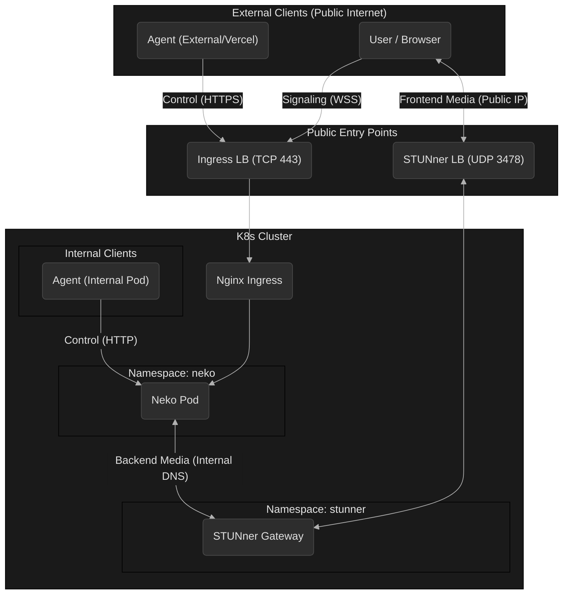
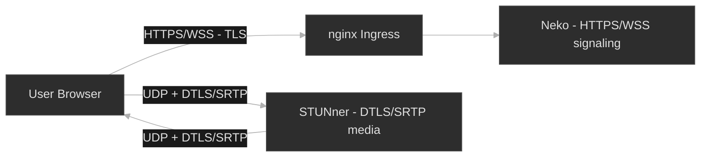

# Browser Agent (Neko & STUNner)

This umbrella chart deploys a complete **Agentic Browser Rendering** solution using **Neko** (browser runtime) and **STUNner** (WebRTC Media Gateway).

## Overview (TL;DR)

### Components

| Entity       | Role Type | Responsibilities                                                             |
| :----------- | :-------- | :--------------------------------------------------------------------------- |
| **Agent**    | Producer  | Issues commands, controls browser intent (External or Internal)              |
| **Neko**     | Platform  | Runtime that executes commands, renders browser, and handles WebRTC encoding |
| **STUNner**  | Platform  | Media Gateway that relays encrypted UDP packets (NAT traversal)              |
| **Consumer** | Viewer    | Human user or UI that views/interacts with the rendered stream               |

### Traffic Paths

*   **Signaling (Control):** HTTPS/WSS over TLS (TCP 443) — *Session setup, SDP exchange*
*   **Media (Pixels):** DTLS/SRTP over UDP (port 3478) — *High-frequency video/audio stream*

## System Architecture



## Connectivity & Data Flow

### Logical Workflow
1.  **Session Start:** Agent (or User) requests a browser session.
2.  **Browser Launch:** Neko starts the browser runtime inside the pod.
3.  **Command Execution:** Agent drives behavior (navigation, clicks, typing) via HTTP/WebSocket commands.
4.  **Rendering:** Neko captures the screen and encodes it into a WebRTC stream.
5.  **Signaling:** Neko and Client exchange connection details (SDP/ICE) via HTTPS/WSS.
6.  **Streaming:** Client receives encrypted media (video/audio) via STUNner over UDP.

### Technical Paths

1.  **Signaling (Control Plane):**
    *   **Path:** `Client -> Ingress (HTTPS/WSS) -> Neko Service -> Neko Pod`.
    *   **Protocol:** TLS (terminated at Ingress), then plain HTTP/WS inside the cluster.
    *   **Function:** Establishes the session, authenticates the user, and exchanges ICE candidates (IPs/Ports).

2.  **Media (Data Plane):**
    *   **Path:** `Client <-> STUNner (UDP LB) <-> Neko Pod`.
    *   **Protocol:** UDP (encrypted with DTLS/SRTP).
    *   **Function:** Streams the actual pixels (video) and audio.
    *   **Why STUNner?** Neko runs inside the cluster and cannot be reached directly via UDP from the internet. STUNner provides a stable public UDP entry point and relays packets to the Neko pod.

## Prerequisites

### Kubernetes Secrets
Before installing the chart, you must create the `neko-secrets` secret in the target namespace. This secret manages credentials for both the Neko application login and the STUNner TURN authentication.

```bash
kubectl create secret generic neko-secrets \
  --namespace neko \
  --from-literal=NEKO_PASSWORD=<user-password> \
  --from-literal=NEKO_PASSWORD_ADMIN=<admin-password> \
  --from-literal=TURN_USERNAME=<turn-username> \
  --from-literal=TURN_PASSWORD=<turn-password>
```

| Key                   | Description                                                             |
| :-------------------- | :---------------------------------------------------------------------- |
| `NEKO_PASSWORD`       | Password for the standard user (viewer/controller)                      |
| `NEKO_PASSWORD_ADMIN` | Password for the admin user                                             |
| `TURN_USERNAME`       | Username for STUN/TURN authentication (shared between Neko and STUNner) |
| `TURN_PASSWORD`       | Password for STUN/TURN authentication                                   |

## Deployment Configuration

This chart wires together two components:

1.  **`neko` (Subchart):**
    *   Runs the Firefox browser.
    *   Configured to use **UDP Mux** on port `59000` (simplifies routing).
    *   **Critical:** It uses *separate* TURN URLs for frontend and backend:
        *   **Frontend:** `turn:<PUBLIC-IP>:3478` (Public IP of STUNner).
        *   **Backend:** `turn:udp-gateway.stunner.svc.cluster.local:3478` (Internal DNS of STUNner).

2.  **`stunner` (Subchart):**
    *   Deploys the STUNner Gateway Operator and Auth Service.
    *   Manages the `udp-gateway` resource.
    *   **UDPRoute:** A specific `UDPRoute` (defined in the Neko chart templates) tells STUNner to route traffic from the Gateway to the Neko Service on port `59000`.

## Security Model



*   **Signaling:** Protected by standard TLS (Let's Encrypt) via Nginx Ingress.
*   **Media:** Protected by **DTLS** (Datagram TLS) and **SRTP** (Secure Real-time Transport Protocol). The TURN server (STUNner) only relays encrypted packets; it cannot decrypt the media.
*   **Authentication:**
    *   **Neko:** Uses a shared secret (`neko-secrets`) for user/admin login.
    *   **TURN:** Uses the same shared secret for TURN authentication (time-limited credentials generated by Neko).

## Gotchas & Known Issues

1.  **UDP Hairpinning:**
    *   Neko (backend) cannot connect to STUNner via its *Public IP* because most Cloud LoadBalancers do not support UDP hairpinning (loopback).
    *   **Fix:** We force Neko to use the *Internal Cluster DNS* of STUNner for its backend connection (`turn.backendUrl`), while the Client uses the *Public IP* (`turn.frontendUrl`).

2.  **Ingress Class:**
    *   Currently configured for `restricted-nginx` (Internal Ingress). For public access, this must be switched to `external-nginx` or similar public ingress controller.

3.  **Network Policies:**
    *   Ensure UDP traffic is allowed between the `stunner` namespace and the `neko` namespace on port `59000`.

## Glossary

| Term            | Meaning                                                                                   |
| :-------------- | :---------------------------------------------------------------------------------------- |
| **WebRTC**      | Browser technology for real-time audio/video exchange via peer-to-peer networking         |
| **Signaling**   | Exchange of session metadata (SDP, ICE candidates) over HTTPS/WSS to set up the call      |
| **ICE**         | Protocol to discover network paths (direct or relay) for connecting peers                 |
| **STUN / TURN** | Protocols for public IP discovery (STUN) and media relaying (TURN) through NATs           |
| **STUNner**     | Kubernetes gateway that bridges WebRTC media from outside (public UDP) to inside clusters |
| **DTLS**        | **Datagram TLS**; secures the UDP connection handshake (similar to HTTPS but for UDP)     |
| **SRTP**        | **Secure RTP**; encrypts the actual audio/video packets flowing over the DTLS connection  |
| **WSS**         | **WebSocket Secure**; the HTTPS-equivalent protocol used for the Signaling channel        |

## Future Improvements

*   **Autoscaling:** Neko is stateful (1 user = 1 browser). Scaling requires a 1-to-1 mapping or a session manager (like Neko Rooms).
*   **TCP Fallback:** Currently only UDP is enabled. Enabling TURN over TCP (port 443/5349) would allow connections from restrictive corporate networks.
*   **Dynamic Provisioning:** Instead of a static Neko pod, integrate with an Agent Orchestrator to spin up Neko pods on demand.
