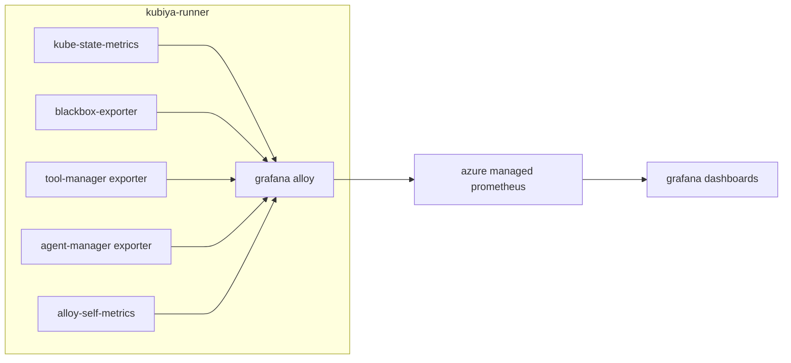
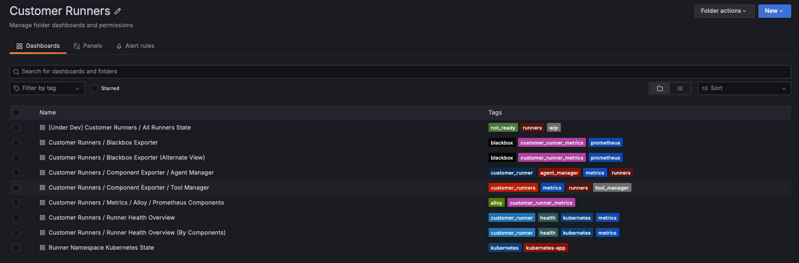
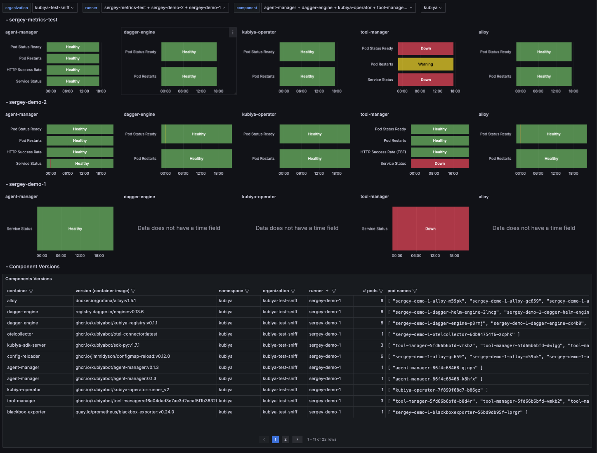
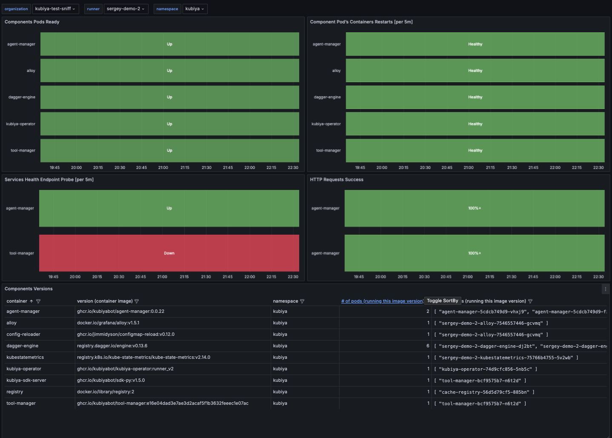
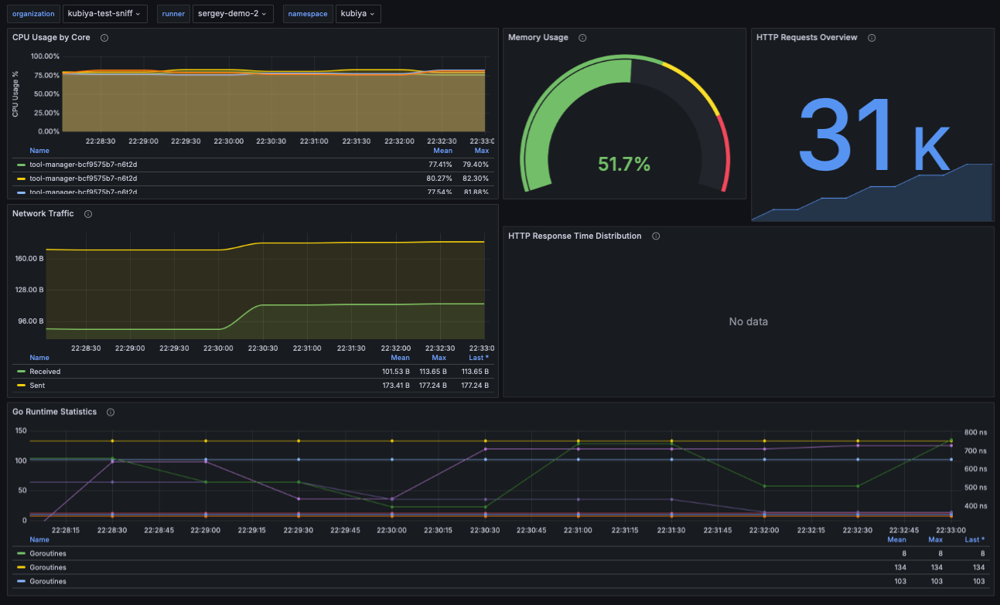
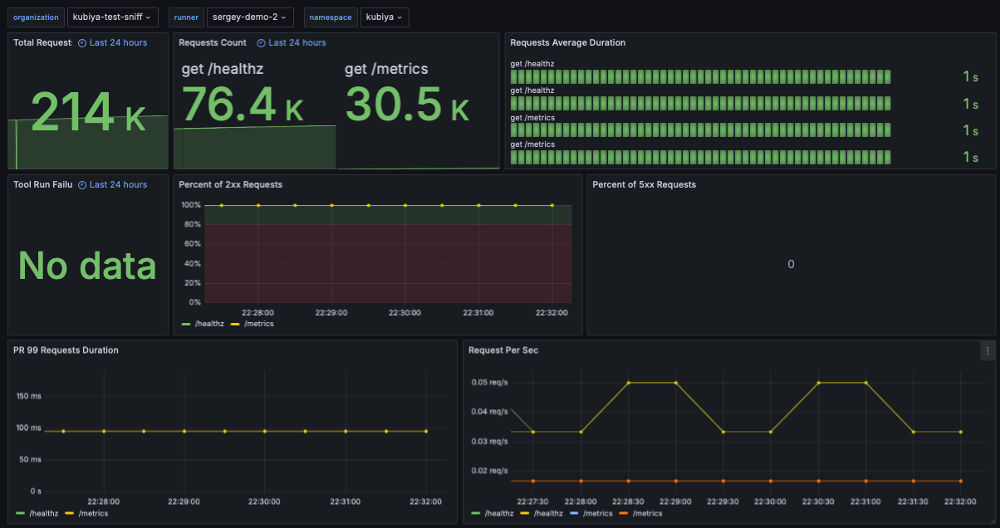
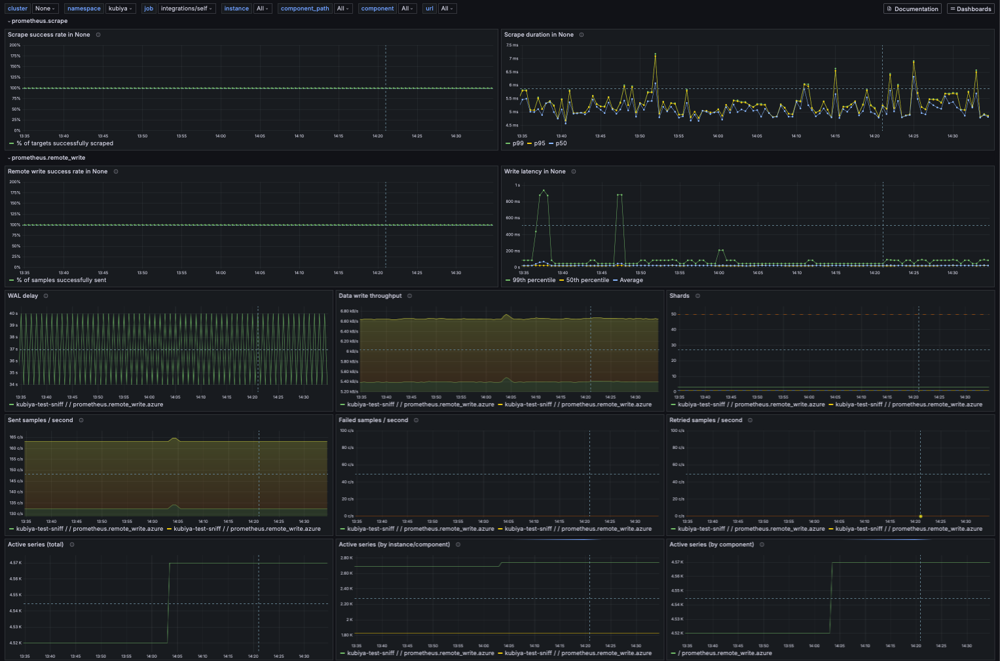
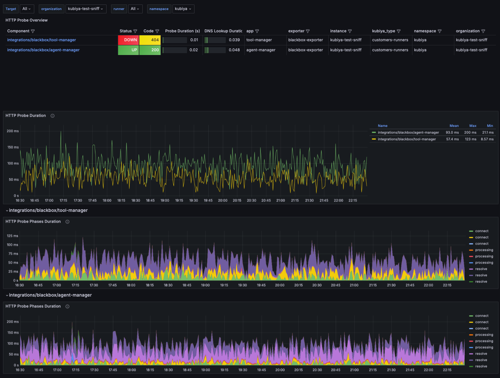
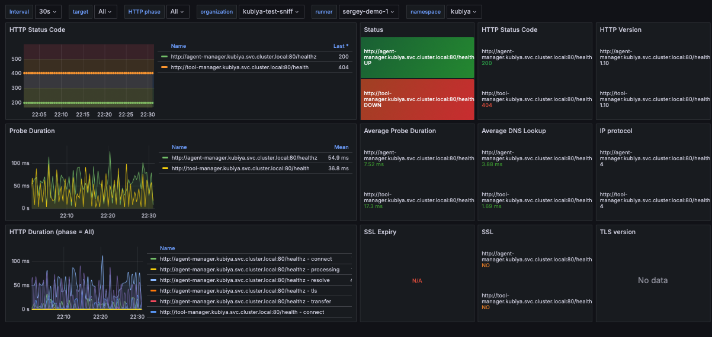

# Kubiya Runner

[](https://artifacthub.io/packages/search?repo=kubiya-helm-charts)

A Helm chart for deploying the Kubiya Runner.

## Table of Contents

- [Kubiya Runner](#kubiya-runner)
  - [Table of Contents](#table-of-contents)
  - [Overview](#overview)
  - [Directory Structure](#directory-structure)
  - [Prerequisites](#prerequisites)
  - [Permissions](#permissions)
  - [Components](#components)
    - [Agent Manager](#agent-manager)
    - [Kubiya Operator](#kubiya-operator)
    - [Tool Manager](#tool-manager)
    - [Image Updater](#image-updater)
  - [Dependencies \& Compatibility Matrix](#dependencies--compatibility-matrix)
    - [Helm Dependencies](#helm-dependencies)
    - [Container Images](#container-images)
  - [Monitoring \& Telemetry](#monitoring--telemetry)
    - [Security](#security)
    - [Architecture](#architecture)
    - [Grafana Alloy Configuration](#grafana-alloy-configuration)
  - [**Azure Prometheus Integration**](#azure-prometheus-integration)
  - [Grafana Dashboards](#grafana-dashboards)
    - [List of available dashboards](#list-of-available-dashboards)
  - [Dashboards as a Code](#dashboards-as-a-code)
  - [K8s Resources Definitions](#k8s-resources-definitions)
  - [Security](#security-1)
  - [Optional Permissions Extensions:](#optional-permissions-extensions)
- [Deployment](#deployment)
  - [Minimum Required Configuration \& Values Passing](#minimum-required-configuration--values-passing)
  - [Installation](#installation)
  - [Update](#update)
  - [Using Name Overrides](#using-name-overrides)

## Overview

This repository contains the Helm chart for deploying the Kubiya Runner, a key component of the Kubiya platform for orchestrating and managing automation workflows. 

## Directory Structure

```shell
kubiya-runner/
├── Chart.yaml                                      # Chart metadata
├── values.yaml                                     # Default values for the chart
├── templates/                                      # Templates files
│   ├── components/                                 # Runner Components
│   │   ├── agent-manager/                         # Manages Kubiya agents lifecycle
│   │   ├── kubiya-operator/                       # Controls operational aspects
│   │   ├── tool-manager/                          # Handles tool execution
│   │   └── image-updater/                         # Automatic image updates
│   ├── alloy-configMap.yaml                       # Alloy configuration
│   └── shared-secrets.yaml                        # Secrets shared between runner components
│   └── _helpers.tpl                               # Helpers funtions for Helm Chart templates rendering
└── charts/                                        # Dependencies (subcharts)
    ├── dagger-helm/                               # Container runtime for workflows
    ├── kube-state-metrics/                        # Cluster-level metrics
    └── alloy/                                     # Grafana Alloy telemetry collector
```

## Prerequisites

- Kubernetes 1.19+
- Helm 3.0+
- PV provisioner support in the underlying infrastructure
- NATS credentials for messaging
- Registry TLS certificates (if using private registry)

## Permissions

## Components

### Agent Manager

Repository: [kubiya-agent-manager](https://github.com/kubiyabot/kubiya-agent-manager)

The Agent Manager handles lifecycle management of Kubiya agents within the cluster.

### Kubiya Operator

Repository: [kubiya-operator](https://github.com/kubiyabot/kubiya-operator)

The Kubiya Operator manages operational aspects and configuration of the runner components.

### Tool Manager

The Kubiya Tool Manager is a high-performance, container-native utility designed for declarative management and execution of agent tools across diverse computing environments. It provides a scalable, stateless architecture for tool orchestration, supporting both local development and enterprise-scale Kubernetes deployments.

Full documentation is available [in project repository](https://github.com/kubiyabot/tool-manager).

- Executes tools within the cluster
- Integrates with Dagger for container runtime
- Includes SDK server for tool execution

### Image Updater

**TBD, (depricated approach)**

```
- Checks for updates of latest stable image versions via CronJob (hourly by default).
- Automatic updates for runner components (agent-manager, tool-manager, sdk-server) from stable release JSON file hosted in [S3 bucket](https://kubiya-cli.s3.amazonaws.com/stable/kubiya_versions.json).
```
## Dependencies & Compatibility Matrix

This chart (as of version 0.6.x) is tested to be compatible with the following versions of container images and Helm dependencies.

### Helm Dependencies

| Chart | Version | App Version |
|-------|---------|--------|  
| dagger-helm | 0.3.0 | 0.11.6 |
| kube-state-metrics | 5.27.0 | 2.14.0 |
| alloy | 0.10.1 | v1.5.1 |

### Container Images

| Component | Image | Version/Tag |
|-----------|-------|-------------|
| Agent Manager | ghcr.io/kubiyabot/agent-manager | 0.0.22 |
| Kubiya Operator | ghcr.io/kubiyabot/kubiya-operator | runner_v2 |
| Tool Manager | ghcr.io/kubiyabot/tool-manager | v0.3.2 |
| SDK Server | ghcr.io/kubiyabot/sdk-py | v1.7.1 |
| Image Updater | bitnami/kubectl | 1.30.6 |
| Dagger Engine | ghcr.io/kubiyabot/kubiya-registry | v0.13.6 |
| Kube State Metrics | registry.k8s.io/kube-state-metrics/kube-state-metrics | 2.14.0 |
| Grafana Alloy | grafana/alloy | v1.5.1 |

## Monitoring & Telemetry

The `kubiya-runner` uses [Grafana Alloy](https://grafana.com/docs/alloy/latest/) for metrics collection from multiple customer runner deployments.
Alloy scrapes data from a set of targets (pods, services, etc.) which expose metrics on an endpoint (usually `/metrics`), processes them (filters, adds runner deployment labels, etc.) and pushes via Prometheus native `remote_writes` into **Azure Managed Prometheus**.

Later `kubiya-runner` chart releases expect to use Alloy for other types of telemetry data collection (such as logs and traces). **Alloy** also fully compatible with OpenTelemetry and can be configured to listen/send messages in `OTEL` format if needed, has a long list of vendor platforms and message formats compatibility and a rich set of data processing modules. 

###  Security

Both `Alloy` and `kube-state-metrics` has limited RBAC permissions and configured to collect only data from same kubernetes namespace where `kubiya-runner` is deployed (`kubiya` by default).
`Alloy` runs as non-root user.

### Architecture



### Grafana Alloy Configuration
  
1. **Resource Management**

  Default resource limits for `alloy`
    ```yaml
    resources:
      limits:
        cpu: 1
        memory: 1Gi
      requests:
        cpu: 100m
        memory: 128Mi
    ```
  `alloy` resource estimation guidelines available at: https://grafana.com/docs/alloy/latest/introduction/estimate-resource-usage/
  
2. **Resources & Data Collection Configuration**

**To minimizes resource usage and cost on both the client and server sides, telemetry collection strategy focuses on deploying and configuring components to capture only the metrics essential for current business and operational goals. This pattern is highly recommended keeping when contributing.**

Alloy is configured with a single scrape interval, collecting metrics from all targets once every 60 seconds. As a result, 60 seconds is the maximum precision for all metric visualizations and alerting.

If this level of precision is insufficient, the scrape interval can be adjusted—either increased or decreased—to balance resource impact. These adjustments can be applied globally or to specific targets via `values.yaml`:

```yaml
  alloy:
    scrapeIntervals:
      default: 60s
      runnerExporters: 60s
      alloyExporter: 60s
      blackboxExporter: 60s
      kubeStateMetrics: 60s
      cadvisor: 60s (disabled by default)
```
## **Azure Prometheus Integration**

Required set of environment variables to be set for Azure Managed Prometheus remote writes support:

- `AZURE_REMOTE_WRITE_URL`: Azure Prometheus endpoint
- `AZURE_CLIENT_ID`: Azure service principal client ID
- `AZURE_CLIENT_SECRET`: Azure service principal secret
- `AZURE_TOKEN_URL`: Azure OAuth token URL

These variables confurable via `values.yaml` `alloy.alloy.extraEnv`)

## Grafana Dashboards

 Grafana dashboards available in the `kubiya-runner` and located in `helm-charts/charts/kubiya-runner/grafana-dashboards/`.

### List of available dashboards



**Health Overview by Components** (`customer-runners-runner-health-overview-by-components.json`)
  
Detailed breakdown of health metrics by individual components for multiple runners.

- Multiple runner instances state
- Component version tracking
- Services status monitoring

| Metric (per 5m span) | Healthy (Green) | Warning (Yellow) | Degraded (Orange) | Down (Red) |
|--------|----------------|------------------|-------------------|------------|
| Service Status | 100% | 95-100% | 80-95% | 0-80% |
| Pod Restarts per | 0-1 restarts | 1.1-2 restarts | 2.1-4 restarts | >4.1 restarts |
| HTTP Success Rate | 100% | 95-99% | 80-94% | 0-79% |
| Pod Status Ready | 100% | 90-99% | 70-89% | 0-69% |




**Runner Health Overview** (`customer-runners-runner-health-overview.json`)
  
- Provides a comprehensive view of runner components' health status
- Filtering by organization, runner and namespace
- Component pods readiness status, restarts, health probes, etc.
- Component container running versions tracking
- Real-time health metrics visualization

| Metric (per 5m span) | Healthy (Green) | Warning (Yellow) | Degraded (Orange) | Down (Red) |
|--------|----------------|------------------|-------------------|------------|
| Service Status | 100% | 95-100% | 80-95% | 0-80% |
| Pod Restarts per | 0-1 restarts | 1.1-2 restarts | 2.1-4 restarts | >4.1 restarts |
| HTTP Success Rate | 100% | 95-99% | 80-94% | 0-79% |
| Pod Status Ready | 100% | 90-99% | 70-89% | 0-69% |



**Tool Manager Dashboard** (`customer-runners-component-exporter-tool-manager.json`)

- Focused on Tool Manager performance metrics
- HTTP response time distribution
- Go runtime metrics (goroutines, threads, GC)
- Request/response statistics



**Agent Manager Dashboard** (`customer-runners-component-exporter-agent-manager.json`)

- Monitors Agent Manager performance
- HTTP request metrics
- Error rate tracking
- Performance indicators



**Kubernetes State Dashboard** (`runner-namespace-kubernetes-state.json`)

(*Under development*)
 
- Provides Kubernetes state metrics for the runner namespace
- Based on `kube-state-metrics` data
- Includes summary metrics about the runner's Kubernetes resources

**Alloy Dashboard** (`customer-runners-metrics-alloy-prometheus-components.json`)

- Monitors Alloy pipelines
- Focus on Remote Writes to Prometheus (success/errors/count,...)
- Can show metrics flow for particular runner deployment (count/error/success/volume etc.
- Visualize targets it scrapes metrics from (count/error/success/volume etc.
- Can be used to control and on data alert spikes (and therefore cost) and broken metrics flow


 
**Blackbox Exporter Dashboards**  (`customer-runners-blackbox-exporter-alternate-view`, 
`customer-runners-blackbox-exporter.json`)

- Alternative visualization of HTTP probe metrics
- Focus on probe success rates and latencies
- SSL/TLS status monitoring
- DNS resolution performance
- Comprehensive HTTP request timing breakdown



 
## Dashboards as a Code

Initial set of dashboards are stored as code for future automatic provisioning into customer's Grafana instances, currently serving as version-controlled backups.

A dashboard export script is available at `kubiya-runner/_grafana-dashboards/grafana-dashboards-export.sh` for exporting dashboards from Azure Managed Grafana. When you create a new dashboard or modify an existing one, the recommended workflow is:

1. Use the export script to save the dashboard as a JSON file
2. Commit the file to the repository
3. Create a pull request to the main branch


## K8s Resources Definitions

All resources defined in `values.yaml` are mandatory, but not yet set according to real consumption. All values must be reviewed and set based on average real usage statistics of from Grafana, with further tuning for particular deployments. Averages are expected as default values in next releases of this chart.

Apart from resource management goals, explicit resources may be mandatory for some particular deployments.
In such deployments pre-installed webhooks may deny installation of runner's k8s entities with unsatisfied requirements (restrictions) of particular target k8s cluster, and requests/limits are common example of such restrictions.

## Security

**Security Considerations:**

- Namespace-scoped RBAC permissions for components (except default required cluster-wide PVC management for `tool-manager` #TODO)
- Dedicated service accounts for each component 
- TLS support for registry communication (used by `tool-manager`)
- Reduced RBAC permissions for `Grafana Alloy` (namespace-scoped)
- Reduced RBAC permissions and targets for `kube-state-metrics` (namespace-scoped)

## Optional Permissions Extensions:

- `tool-manager`: optional cluster full access via `values.adminClusterRole.create`,
- Kubiya Operator full access toggle (controlled via values)
- Optional Dagger permissions

# Deployment

As of moment of writing this, default configuration set via `values.yaml` should support most of the regular deployments. However, there are list of variables specific to each particular deployment, as well as list of secrets which must be configured before installing this chart.

## Minimum Required Configuration & Values Passing

Values below can be considered as non-mutable secrets, unique for each runner deployment.

- `alloy.alloy.extraENV` all env vars must be set for support of metrics push to remote Prometheus via remote writes (see [Azure Prometheus Integration](#azure-prometheus-integration))
- `organization`: "my_organization" - given organization name
- `uuid`: "679adc53-7068-4454-aa9f-16df30b14a50" - UUID of the agent
- `nats.jwt` and `nats.secondJwt`: NATS credentials for sending metrics to NATS Cloud (Synadia). Tokens are generated by kubiya frontend UI with frontend-specific runner name encoded as a part of token.
- `nats.subject`: NATS destination subject for metrics sending
- `nats.serverUrl`: NATS server URL

These requirements are present in a structured way in template file `_deploymentX-values-overrides.yaml` and expected to be in sync with requirements of current chart version. 
Instead of passing values to helm install if form of `-set xxx=yyy`, it is highly recommended making a copy of this file as overrides base for a new deployment, and after installation keep it in safe, dry place for future purposes (upgrades, etc.)

## Installation

 *IMPORTANT* Runner name will be set to the release name by default (`deploymentX` in example cmd below).
 If not overriden (see below) release name must match runner's name encoded in JWT token which set in `nats.*` values.

```shell
helm install deploymentX . -f values.yaml -f _deploymentX-values-overrides.yaml --namespace kubiya --create-namespace
```

## Update

```shell
helm upgrade deploymentX . -f values.yaml -f _deploymentX-values-overrides.yaml --namespace kubiya
``` 

## Using Name Overrides

`runnerNameOverride` if used, must match the JWT token for NATS communication. 

In some special cases there are name overrides values available to override runner name

If `helm install my-release ./kubiya-runner:` used for installation, then:
- If `runnerNameOverride`: "my-metrics-test":
  - name = *my-metrics-test*
  - fullname = *my-metrics-test*
  - All resources will use this name

- If no `runnerNameOverride` but `nameOverride`: "custom":
  - name = *custom*
  - fullname = *my-release-custom*

- If no `runnerNameOverride` but `fullnameOverride`: "full-custom":
  - name = Chart.Name or `nameOverride`
  - fullname = *full-custom*

- If no overrides:
  - name = Chart.Name
  - fullname = *my-release-kubiya-runner*

