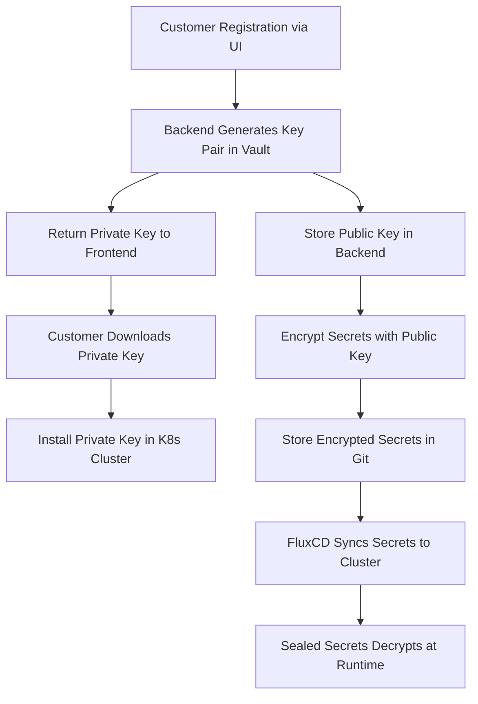

# Repository Structure

1. Helm Charts repo: current repo, contains our helm charts, docs, shared resources.

```
helm-charts/
├── charts/
│   ├── kubiya-runner/
│   │   ├── Chart.yaml
│   │   ├── values.yaml
│   │   └── templates/
│   └── dagger-helm/
│       ├── Chart.yaml
│       ├── values.yaml
│       └── templates/
└── README.md
```

2. Deployments configs repo: centralized, single source of true for all runners deployments configs. Desired state for all runners deployments configs (container version, secrets, scaling options, env var, etc.)

```
flux-repo/
├── clients/
│   ├── client-a/
│   │   ├── helmrelease.yaml       # Defines Helm release for client A
│   │   ├── values_override.yaml   # Non-sensitive values
│   │   ├── values_override.enc.yaml # Encrypted secrets
│   ├── client-b/
│   │   ├── helmrelease.yaml
│   │   ├── values_override.yaml
│   │   ├── values_override.enc.yaml
└── README.md
```

`helmrelease` example:

```yaml
apiVersion: helm.toolkit.fluxcd.io/v2beta1
kind: HelmRelease
metadata:
  name: kubiya-runner
  namespace: kubiya
spec:
  releaseName: kubiya-runner-customer-name
  chart:
    spec:
      chart: kubiya-runner
      sourceRef:
        kind: GitRepository
        name: helm-charts
        namespace: kubiya
        ref:
          branch: main
  interval: 5m
  valuesFrom:
    - kind: ConfigMap
      name: customer-overrides
      valuesKey: overrides.yaml
```

Overrides are used to override customer specific values in the Helm chart:

```yaml
organization: "customer-org"
uuid: "123exxxx7-e89b-12d3-a456-xxxxxx"
nats:
  jwt: "customer-specific-jwt"
  secondJwt: "customer-specific-second-jwt"
  subject: "customer-specific-subject"
toolManager:
  image:
    repository: "ghcr.io/kubiyabot/tool-manager"
    tag: "v1.20.0"
agentManager:
  replicas: 2
  env:
    - name: CUSTOM_ENV_VAR
      value: "custom-value"
  image:
    repository: "ghcr.io/kubiyabot/tool-manager"
    tag: "v1.20.0"
```

1. `FluxCD` Controller: Manages the deployment of the Helm charts to the Kubernetes clusters 
    - Installed along with runner in kubiya namespace customer's K8s cluster
    - Resources overhead (max. avg): 200 MB / 0.2 CPU

# How it works

1. The Helm Charts Repository is updated with the latest changes.
2. The FluxCD Controller detects the changes and applies them to the Kubernetes clusters by running `helm upgrade`
3. Secrets are encrypted (sealed) on our side and stored in the Runners configs repo.
4. Customer gets decryption keys from Kubiya - the only one key needed to decrypt all the secrets, customer specific.

# Deployment Process

1. Helm Charts Repository: Develop and maintain your Helm charts here. This repository is referenced by the customer configurations.
2. Customer Configurations Repository: Manage customer-specific configurations and overrides here. Each customer has its own directory with specific unique values, which are used to override the default values in the Helm chart.
3. FluxCD Setup: FluxCD is configured to monitor the customer configurations repository. It will apply the HelmRelease resources, which reference the Helm charts repository. FluxCD will also decrypt the secrets and apply them to the Kubernetes clusters.
4. Customer gets decryption key from Kubiya on initial deployment step - only one key needed to decrypt all the secrets (one key per customer).
5. Separation of Concerns: This setup allows to update Helm charts independently of customer-specific configurations, providing flexibility and modularity.


# Key Points

- A *centralized* place for remote runners, configurations/secrets, git level versioning and tracability
- Easy upgrades, rollouts and rollbacks: from GUI, manual or automated git commits from CD pipelines, 1-to-many config clones (mass update)
- Branching for development on multiple staging/prod envs
- Detaching from frontend: no more pain, bugs and effort wasted on passing updated list of values one by one to `helm install ...` UI
- Separation of deployment configs from charts repo: less chance of conflicts, easier to manage and scale, more secure - less chance of unencrypted secrets leaking to public repo
- Security single per customer key for encryption sensitive data data. Customer names can be replaced with uuids for extra security.
- FluxCD deployments - CNCF graduated, lightweight, technically and conceptually easy to go
- POC without secrets - can be done in a day

# NATS

- Can be used as a secret manager as we already have NATS in place (althougth it's not free).
- Or, it can securely host deployments configuration "repo" too (e.g. key value or file storage backend)


# Sealed Secrets

- Example of a Sealed Secret

```yaml
apiVersion: v1
kind: Secret
metadata:
     name: my-secret
     namespace: default
   type: Opaque
   data:
     username: bXktdXNlcm5hbWU=  # base64 encoded 'my-username'
     password: c2VjdXJlLXBhc3N3b3Jk  # base64 encoded 'secure-password'
```

2. Seal the Secret

Use the kubeseal CLI tool to encrypt the secret. This requires access to the Sealed Secrets controller's public key, which is typically available in k8s cluster.
```bash
kubectl create secret generic my-secret --dry-run=client --from-literal=username=my-username --from-literal=password=secure-password -o yaml | kubeseal --format yaml > sealed-secret.yaml
```

3. The `sealed-secret.yaml` file will look something like this:

```yaml
apiVersion: bitnami.com/v1alpha1
kind: SealedSecret
metadata:
     name: my-secret
     namespace: default
   spec:
     encryptedData:
       password: AgB+3J... (encrypted data)
       username: AgB+3J... (encrypted data)
```

## Workflow for Using Sealed Secrets

1. Install the Sealed Secrets Controller

```bash
kubectl apply -f https://github.com/bitnami-labs/sealed-secrets/releases/download/v0.17.0/controller.yaml
```

2. Commit encrypted sealed Secret to Git as-is

3. Deploy the Sealed Secret to k8s cluster as a regular Secret

```bash
kubectl apply -f sealed-secret.yaml
```

# Keys / Vault

# Private (decryption) key provided to customer only once stored as secret in their k8s



# Private key stored in our Vault

1.	Customer registers via frontend.
2.	Backend calls Vault to generate a per-customer key pair.
3.	Vault stores the private key & grants customer access.
4.	Customer’s Kubernetes cluster fetches and installs the private key.
5.	Secrets are encrypted with the public key and stored in Git.
6.	FluxCD syncs encrypted secrets into the customer’s cluster.
7.	Sealed Secrets decrypts secrets at runtime inside Kubernetes.
